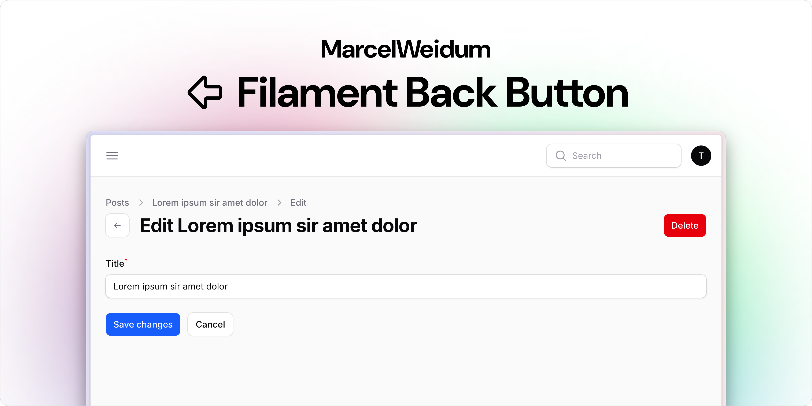

# Filament back button

[](https://packagist.org/packages/marcelweidum/filament-back-button)
[](https://packagist.org/packages/marcelweidum/filament-back-button)
[](https://github.com/marcelweidum/filament-back-button/actions?query=workflow%3A"Fix+PHP+code+styling"+branch%3Amain)


Brings a back button to a resource view/edit page

<picture>
  <source media="(prefers-color-scheme: dark)" srcset="art/cover-dark.png">
  <source media="(prefers-color-scheme: light)" srcset="art/cover-light.png">
  
</picture>

## Installation

You can install the package via composer:

```bash
composer require marcelweidum/filament-back-button
```

> [!IMPORTANT]
> If you have not set up a custom theme and are using Filament Panels follow the instructions in the [Filament Docs](https://filamentphp.com/docs/4.x/styling/overview#creating-a-custom-theme) first.

After setting up a custom theme add the plugin's views to your theme css file or your app's css file if using the standalone packages.

```css
@source '../../../../vendor/marcelweidum/filament-back-button/resources/**/*.blade.php';
```

You can publish the config file with:

```bash
php artisan vendor:publish --tag="filament-back-button-config"
```

Optionally, you can publish the views using

```bash
php artisan vendor:publish --tag="filament-back-button-views"
```

This is the contents of the published config file:

```php
return [
];
```

## Contributing

Please see [CONTRIBUTING](.github/CONTRIBUTING.md) for details.

## Security Vulnerabilities

Please review [our security policy](.github/SECURITY.md) on how to report security vulnerabilities.

## Credits

- [MarcelWeidum](https://github.com/MarcelWeidum)
- [All Contributors](../../contributors)

## License

The MIT License (MIT). Please see [License File](LICENSE.md) for more information.
